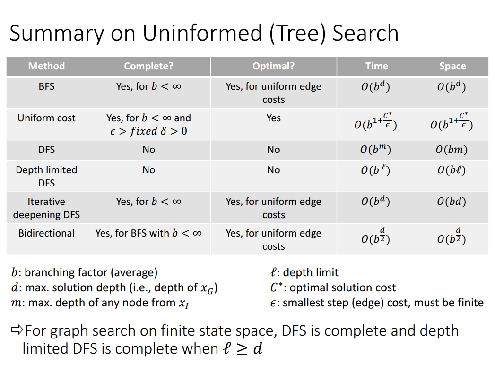

# Graph & Topological Sort，图与拓扑排序 \(待续\)

Graph可以涵盖的范围非常广，我在看到一道Dropbox的[OA](http://www.1point3acres.com/bbs/thread-440508-1-1.html)的时候，感觉是一道DFS+染色的问题，细想的话，如果“病毒”传播是单向的，就抽象成了一个有向图的题目。

还有其他很多问题可以抽象成图，比如搜索问题，树，迷宫，矩阵路线，以后再继续总结。

 

* BFS 的时间空间占用以 branching factor 为底， 到解的距离 d 为指数增长；空间占用上 Queue 是不会像 DFS 一样只存一条路径的，而是从起点出发越扩越大，因此会有空间不够的风险，空间占用为 O\(b^d\)。
* DFS 的时间占用以 branching factor 为底，树的深度 m 为指数增长；而空间占用上，却只是 O\(bm\)，可视化探索过程中只把每个 Node 的所有子节点存在 Stack 上， 探索完了再 pop 出来接着探，因此储存的节点数为 O\(bm\)。

可以看到无论是 BFS 还是 DFS，树的 branching factor 都是对空间与时间复杂度影响最大的参数；除此之外，BFS 中最重要的是到解的距离，而 DFS 看从当前节点的深度。普遍来讲，DFS 空间上会经济一些，当然也要分情况讨论。

